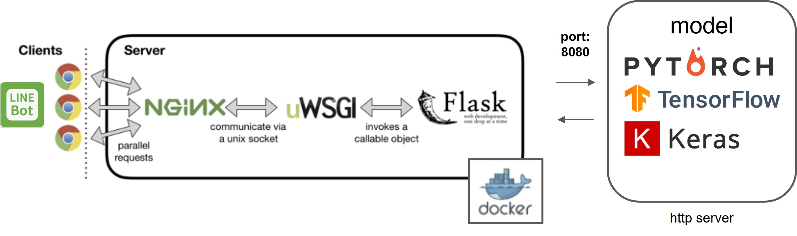
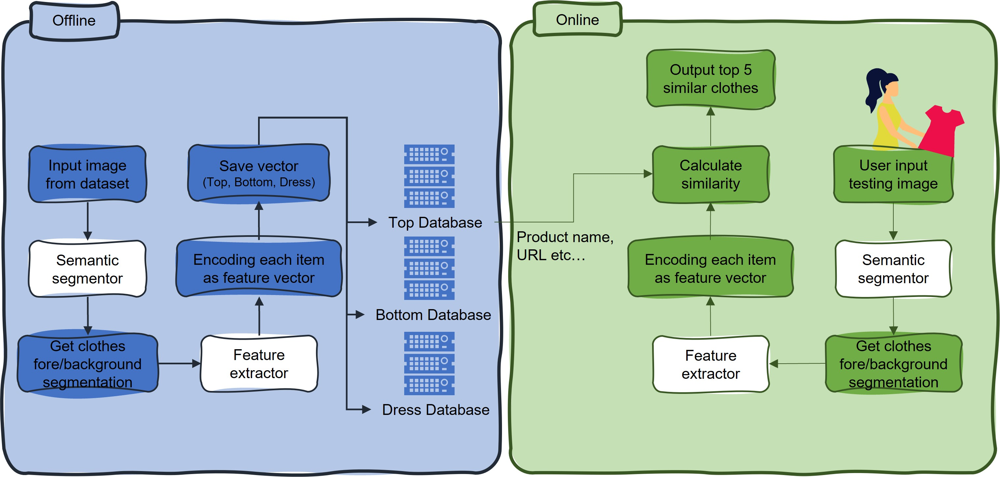
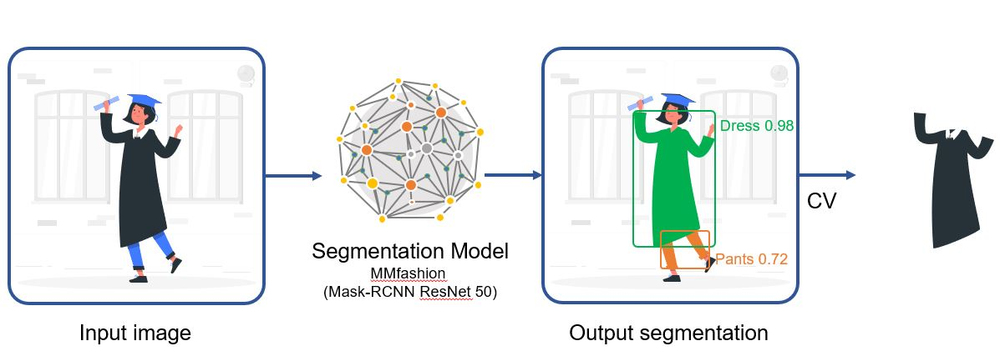
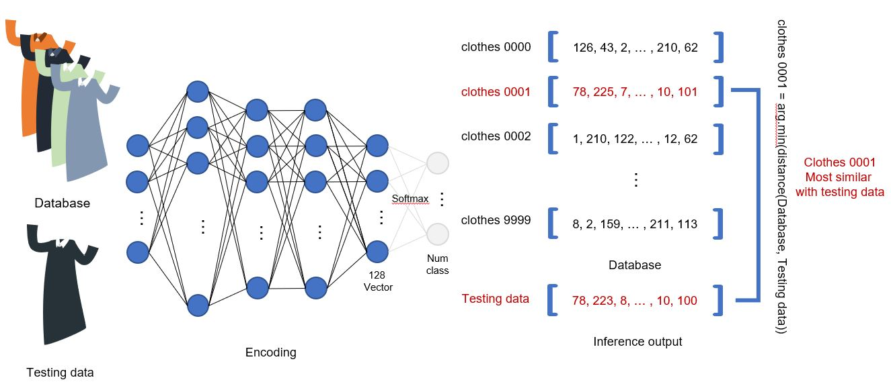

# Demo


# Introduction
### System


### Flow Chart


### Segmentation Model


### Feature Extration Model



# Getting start
> #### Download Pre-trained models
Download [Pre-trained model](https://drive.google.com/open?id=1q6zF7J6Gb-FFgM87oIORIt6uBozaXp5r) and rename it as ```segmentation.pth``` then place it to ```./app/data/model/```

> #### Installation
```sh
pip install -r ./app/models/requirements.txt
```
    install mmfashion (https://github.com/open-mmlab/mmfashion)
> ### ./app/models/bin/recommend_clothing.sh (http server port=8080)
     - @app.route("/get_rec_product", methods=['POST'])

 
> ### ./docker/start_flask.sh (flask port=80)
    - @app.get('/ping')
    - LINE part
        * @app.route("/callback", methods=['POST'])
            - @handler.add(MessageEvent, message=(ImageMessage, VideoMessage, AudioMessage))
            - @handler.add(MessageEvent, message=TextMessage)
